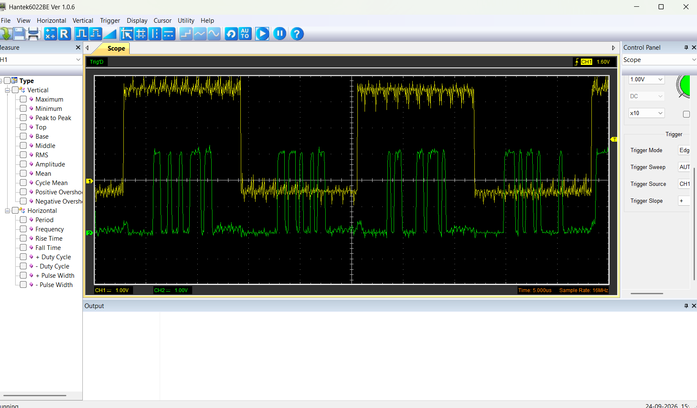

# BasicSetUpMicsPairs

## Objetivo

`BasicSetUpMicsPairs` es una evolución directa del proyecto `BasicSetUpMics`.

El objetivo de esta etapa es validar que **dos micrófonos digitales ICS-43434 puedan compartir una misma línea de datos I2S**, utilizando:

- BCLK compartido
- LRCL / WS compartido
- DOUT compartido
- un micrófono con `SEL = GND`
- un micrófono con `SEL = VDD`

y comprobar que el STM32H747XI puede recibir simultáneamente ambos micrófonos mediante:

```text
SAI2 Block A
PI6 / SAI2_SD_A
```

separando correctamente:

```text
SLOT0
SLOT1
```

Esta etapa parte del banco previamente validado `BasicSetUpMics`, donde se demostró individualmente que los micrófonos funcionales:

- generan audio correctamente;
- transmiten por DOUT;
- pueden utilizar SLOT0 o SLOT1;
- cambian correctamente de slot mediante el pin SEL.

El propósito de `BasicSetUpMicsPairs` es comprobar ahora la operación simultánea de **dos micrófonos sobre una única línea DOUT**.

---

# Arquitectura del proyecto

El proyecto continúa utilizando únicamente:

```text
SAI2 Block A
```

No se utiliza todavía:

```text
SAI2 Block B
PG10 / SAI2_SD_B
```

La arquitectura actual es:

```text
MIC A ----+
          |
          +---- DOUT compartido ----> PI6 / SAI2_SD_A
          |
MIC B ----+

MIC A BCLK --------------------------> PI5 / SAI2_SCK_A
MIC B BCLK --------------------------> PI5 / SAI2_SCK_A

MIC A LRCL --------------------------> PI7 / SAI2_FS_A
MIC B LRCL --------------------------> PI7 / SAI2_FS_A
```

Los dos micrófonos utilizan estados SEL opuestos.

Ejemplo:

```text
MIC A
SEL = GND
-> SLOT0

MIC B
SEL = VDD
-> SLOT1
```

---

# Esquema del montaje

El esquema físico utilizado para esta etapa se encuentra en:


La conexión validada es:

```text
STM32 / Portenta                  MIC A                    MIC B
---------------------------------------------------------------------

PI5 / SAI2_SCK_A  ----------->   BCLK                     BCLK

PI7 / SAI2_FS_A   ----------->   LRCL / WS                LRCL / WS

PI6 / SAI2_SD_A   <-----------   DOUT --------+
                                               |
                                  DOUT --------+

3.3 V             ----------->   3V                       3V

GND               ----------->   GND                      GND
```

Los dos DOUT se unen físicamente y terminan en:

```text
PI6 / SAI2_SD_A
```

---

# Equivalencias importantes

En el ICS-43434:

```text
BCLK = SCK

LRCL = WS = FS

DOUT = SD
```

Por lo tanto:

```text
BCLK != LRCL
```

Estas señales no deben intercambiarse.

La conexión correcta es:

```text
PI5 -> BCLK

PI7 -> LRCL / WS

PI6 <- DOUT
```

---

# Selección de slot mediante SEL

Las pruebas individuales realizadas previamente demostraron:

```text
SEL = GND
-> SLOT0
```

y:

```text
SEL = VDD
-> SLOT1
```

En `BasicSetUpMicsPairs` se aprovecha esta característica para conectar dos micrófonos a la misma línea DOUT.

Cuando ambos SEL funcionan correctamente:

```text
MIC A SEL=GND
-> SLOT0

MIC B SEL=VDD
-> SLOT1
```

Cada micrófono utiliza una mitad diferente del frame I2S.

---

# Configuración SAI

La configuración utilizada permanece basada en el banco validado anteriormente.

```text
Peripheral      : SAI2 Block A
Mode            : MASTER_RX
Synchronization : ASYNCHRONOUS
Protocol        : I2S Standard
Data Size       : 24 bit
Slots           : 2
Sample Rate     : 44.1 kHz
```

La inicialización utiliza:

```c
HAL_SAI_InitProtocol(
    &hsai_BlockA2,
    SAI_I2S_STANDARD,
    SAI_PROTOCOL_DATASIZE_24BIT,
    2U
);
```

Los dos slots son recibidos mediante la misma entrada:

```text
PI6 / SAI2_SD_A
```

Conceptualmente:

```text
word 0 -> SLOT0
word 1 -> SLOT1
word 2 -> SLOT0
word 3 -> SLOT1
...
```

---

# Frecuencias I2S

La frecuencia de muestreo es:

```text
Fs = 44.1 kHz
```

Cada frame contiene:

```text
2 slots
```

con aproximadamente:

```text
32 BCLK por slot
```

por lo tanto:

```text
64 BCLK por frame
```

La frecuencia aproximada de BCLK es:

```text
44100 x 64
=
2.8224 MHz
```

Valores esperados:

```text
LRCL / WS ≈ 44.1 kHz

BCLK      ≈ 2.82 MHz
```

---

# DMA

SAI2A utiliza DMA circular.

Configuración:

```text
Direction        : Peripheral to Memory
Peripheral Inc   : Disabled
Memory Inc       : Enabled
Peripheral Align : Word
Memory Align     : Word
Mode             : Circular
Priority         : Very High
```

El buffer se encuentra en RAM D2:

```c
__attribute__((section(".RAM_D2_bss"), aligned(32)))
```

Durante las pruebas se confirmó:

```text
cpu_addr == dma_m0ar
```

por lo que DMA escribe en el mismo buffer posteriormente procesado por CPU.

---

# Firmware utilizado

La fase actual utiliza el firmware diagnóstico:

```text
BasicSetupMics P0.2c
SAI2A
PI6 GPIO-IDR
DMA diagnostic
```

Algunos mensajes UART todavía contienen textos heredados de la versión de un solo micrófono:

```text
single-mic
```

y:

```text
Micros fisicos : 1
```

Estos textos no representan una limitación funcional.

El firmware recibe actualmente:

```text
SLOT0
+
SLOT1
```

simultáneamente.

---

# Cómo compilar

## 1. Abrir STM32CubeIDE

Abrir el workspace utilizado durante el desarrollo.

El proyecto correspondiente a esta fase es:

```text
BasicSetUpMicsPairs
BasicSetUpMicsPairs_CM7
BasicSetUpMicsPairs_CM4
```

Actualmente se utiliza únicamente:

```text
CM7
```

---

## 2. Seleccionar CM7

Seleccionar:

```text
BasicSetUpMicsPairs_CM7
```

---

## 3. Hacer Build

En STM32CubeIDE:

```text
Right Click
-> Build Project
```

El linker debe utilizar:

```text
BasicSetUpMicsPairs\CM7\STM32H747XIHX_FLASH.ld
```

El proceso genera:

```text
BasicSetUpMicsPairs_CM7.elf
BasicSetUpMicsPairs_CM7.map
BasicSetUpMicsPairs_CM7.list
```

---

# Warnings conocidos

STM32CubeIDE puede mostrar warnings relacionados con `newlib-nano`:

```text
_close
_fstat
_getpid
_isatty
_kill
_lseek
_read
_write
```

Aunque CubeIDE pueda mostrar mensajes de error en el panel Problems, el firmware genera correctamente:

```text
BasicSetUpMicsPairs_CM7.elf
```

Estos mensajes no se consideran actualmente un fallo funcional del proyecto.

---

# Cómo flashear

Después del Build:

1. conectar la Portenta H7;
2. seleccionar `BasicSetUpMicsPairs_CM7`;
3. utilizar la configuración habitual de programación;
4. flashear el ELF generado;
5. reiniciar la placa si es necesario;
6. mantener la Portenta conectada por USB.

UART:

```text
1,000,000 baud
```

Durante estas pruebas se utilizó:

```text
COM6
```

---

# Secuencia correcta de ejecución

Antes de modificar:

```text
SEL
DOUT
BCLK
LRCL
3V
GND
```

apagar completamente la alimentación.

Después:

1. verificar conexiones;
2. conectar un micrófono con SEL=GND;
3. conectar el otro con SEL=VDD;
4. verificar DOUT común;
5. alimentar;
6. verificar UART;
7. ejecutar la captura.

---

# Script de captura

El script utilizado es:

```text
grabar_sesion_basico.py
```

Ejemplo:

```powershell
python grabar_sesion_basico.py --port COM6 --session 1034 --order 1
```

El script:

1. abre UART;
2. espera `[BASIC_READY]`;
3. envía `R`;
4. espera la captura;
5. recibe SLOT0;
6. recibe SLOT1;
7. genera JSON;
8. genera metadata.

---

# Preroll

Después de recibir `R`, el STM32 mantiene aproximadamente:

```text
3000 ms
```

de clocks activos antes del segundo útil.

Por esta razón se utilizó una fuente continua de sonido.

La captura almacena aproximadamente:

```text
1 segundo
```

con:

```text
44100 muestras por slot
```

---

# Archivos generados

Ejemplo:

```text
json_test/sound/sound_s1034_ord1_slot0.json

json_test/sound/sound_s1034_ord1_slot1.json
```

Cada archivo contiene:

```text
44100 muestras
```

---

# Conversión a WAV

Se utiliza:

```text
json_to_wav_basico.py
```

Ejemplo:

```powershell
python json_to_wav_basico.py --session 1034
```

La comprobación auditiva de los WAV forma parte de la validación.

---

# Medición Hantek LRCL + DOUT

La captura de referencia se encuentra en:



Configuración:

```text
CH1 -> LRCL / WS común

CH2 -> DOUT común

Time/Div = 5 us/div

Sample Rate = 16 MHz

CH1 = 1.00 V/div

CH2 = 1.00 V/div

DC coupling

Probe físico = 10X

Software = x10

Trigger Source = CH1

Trigger Slope = +

Trigger Level ≈ 1.6 V
```

---

# Interpretación sencilla de la captura

La señal amarilla:

```text
CH1
```

es:

```text
LRCL / WS
```

LRCL funciona como una señal que divide el tiempo en dos turnos:

```text
SLOT0
SLOT1
SLOT0
SLOT1
...
```

La señal verde:

```text
CH2
```

es:

```text
DOUT compartido
```

Se observa actividad digital durante ambas mitades de LRCL.

Esto significa que la misma línea física DOUT está transportando información durante:

```text
SLOT0
```

y durante:

```text
SLOT1
```

lo cual es consistente con dos micrófonos compartiendo correctamente la misma línea.

Conceptualmente:

```text
LRCL indica de quién es el turno.

DOUT transporta los datos del micrófono correspondiente a ese turno.
```

---

# Interferencia observada

La línea DOUT no aparece completamente limpia.

Se observa cierta:

```text
rugosidad
ringing
interferencia
```

Las posibles causas incluyen:

```text
cableado provisional
bifurcaciones
retornos de GND
flancos rápidos
layout temporal
acoplamiento entre señales
sondas del osciloscopio
```

Sin embargo, esta interferencia no impidió obtener:

```text
dos slots activos
audio válido
PCM válido
JSON independiente
WAV independiente
```

Por tanto se clasifica como:

```text
OBSERVACIÓN / PENDIENTE DE OPTIMIZACIÓN
```

y no como fallo de la arquitectura.

---

# Validación con distintas parejas de micrófonos

Después de validar inicialmente MIC5 + MIC6, se decidió repetir la prueba con otras parejas.

El objetivo era comprobar que el funcionamiento no dependiera únicamente de dos módulos concretos.

Se probaron:

```text
MIC5 + MIC6

MIC2 + MIC4

MIC3 + MIC7
```

---

# Pareja 1 - MIC5 + MIC6

## Sesión 1032

Configuración:

```text
MIC5 SEL=VDD -> SLOT1
MIC6 SEL=GND -> SLOT0
```

Resultados:

```text
SLOT0
RMS  = 0.010494
dBFS = -39.58

SLOT1
RMS  = 0.010630
dBFS = -39.47
```

Comparación:

```text
exact_equal = 37

equal_pct = 0.0839 %

correlation = 0.1703

rms_difference = 0.01361
```

Resultado:

```text
PASS
```

---

## Sesión 1033

Se invirtieron los SEL:

```text
MIC5 SEL=GND -> SLOT0
MIC6 SEL=VDD -> SLOT1
```

Resultados:

```text
SLOT0 = -38.92 dBFS

SLOT1 = -39.57 dBFS
```

Comparación:

```text
exact_equal = 45

equal_pct = 0.102 %

correlation = 0.3551

rms_difference = 0.01242
```

Resultado:

```text
PASS
```

---

## Sesión 1034

Configuración:

```text
MIC5 SEL=GND -> SLOT0
MIC6 SEL=VDD -> SLOT1
```

Resultados:

```text
SLOT0 = -37.32 dBFS

SLOT1 = -38.02 dBFS
```

Comparación:

```text
exact_equal = 36

equal_pct = 0.0816 %

correlation = 0.3895

rms_difference = 0.01448
```

Resultado:

```text
PASS
```

Esta sesión también fue utilizada como referencia para la captura Hantek LRCL + DOUT.

---

# Conclusión MIC5 + MIC6

La pareja funcionó correctamente en ambos sentidos de SEL.

Se validó:

```text
DOUT compartido

SLOT0 + SLOT1 simultáneos

datos independientes

WAV independientes

cambio de slot mediante SEL
```

Estado:

```text
MIC5 + MIC6
PASS
```

---

# Pareja 2 - MIC2 + MIC4

## Sesión 1035

Configuración:

```text
MIC2 SEL=GND -> SLOT0
MIC4 SEL=VDD -> SLOT1
```

Resultados:

```text
MIC2 / SLOT0
dBFS = -38.65

MIC4 / SLOT1
dBFS = -44.90
```

Diferencia aproximada:

```text
6.25 dB
```

Resultado digital:

```text
raw_nz0 = 44100
raw_nz1 = 44099
```

Estado:

```text
PASS
```

---

## Sesión 1036

Configuración inversa:

```text
MIC2 SEL=VDD -> SLOT1
MIC4 SEL=GND -> SLOT0
```

Resultados:

```text
MIC4 / SLOT0
dBFS = -45.70

MIC2 / SLOT1
dBFS = -38.22
```

Comparación:

```text
exact_equal = 50

equal_pct = 0.1134 %

correlation = 0.2398

rms_difference = 0.01213
```

Resultado:

```text
PASS
```

---

# Observación sobre MIC4

MIC4 presenta consistentemente menor nivel acústico que MIC2.

La diferencia siguió al micrófono físico cuando se intercambiaron los slots.

Por tanto:

```text
el nivel bajo NO pertenece al SLOT0

el nivel bajo NO pertenece al SLOT1

el nivel bajo sigue a MIC4
```

MIC4 continúa siendo:

```text
digitalmente funcional
acústicamente útil
```

pero con menor nivel que otros micrófonos probados.

Estado:

```text
MIC4
FUNCIONAL
NIVEL ACÚSTICO MENOR
```

---

# Conclusión MIC2 + MIC4

```text
MIC2 + MIC4
PASS
```

La segunda pareja validó nuevamente:

```text
2 mics
1 DOUT
2 slots
cambio de SEL
audio independiente
```

---

# Pareja 3 - MIC3 + MIC7

Esta pareja presentó un comportamiento más irregular.

Las primeras pruebas mostraron que ambos micrófonos habían funcionado correctamente de forma individual anteriormente.

Sin embargo, al realizar múltiples cambios físicos de SEL y cableado, comenzaron a observarse resultados inconsistentes.

---

# Sesión 1037

Configuración:

```text
MIC3 SEL=GND -> SLOT0
MIC7 SEL=VDD -> SLOT1
```

Resultados:

```text
MIC3 / SLOT0
-41.95 dBFS

MIC7 / SLOT1
-79.71 dBFS
```

MIC3 produjo audio útil.

MIC7 quedó prácticamente al nivel de ruido.

---

# Sesión 1038

Configuración prevista:

```text
MIC3 SEL=VDD -> SLOT1
MIC7 SEL=GND -> SLOT0
```

Resultados:

```text
SLOT0 = -80.22 dBFS

SLOT1 = -38.90 dBFS
```

El comportamiento bajo cambió de slot.

Esto inicialmente hizo sospechar de MIC7.

---

# Sesiones 1039 y 1040

Después de manipular físicamente conexiones y soldaduras:

```text
PI6_high  = 0
PI6_trans = 0
```

y:

```text
raw_nz0 = 0
raw_nz1 = 0
```

Los dos slots quedaron completamente en cero.

Se verificó con multímetro:

```text
continuidad de DOUT
continuidad de BCLK
continuidad de LRCL
3.3 V
GND
SEL
```

sin encontrar una discontinuidad evidente.

---

# Prueba de aislamiento MIC3 / MIC7

Para identificar qué micrófono estaba afectando el bus se desconectaron individualmente los DOUT.

---

## Sesión 1041

Configuración:

```text
MIC3 SEL=GND
MIC3 DOUT conectado

MIC7 SEL=VDD
MIC7 DOUT desconectado
```

Resultado:

```text
SLOT0 = -76.64 dBFS

SLOT1 = 0
```

PI6 volvió a tener actividad:

```text
PI6_trans = 28833
```

pero MIC3 entregó un nivel extremadamente bajo.

---

## Sesión 1042

Configuración opuesta:

```text
MIC3 DOUT desconectado

MIC7 SEL=VDD
MIC7 DOUT conectado
```

Resultado:

```text
SLOT0 = 0

SLOT1 = -38.82 dBFS
```

Además:

```text
raw_nz1 = 44098

pcm_nz1 = 44053

PI6_trans = 41084
```

Esto confirmó que:

```text
MIC7 funciona correctamente de forma individual.
```

---

# Remontaje físico de MIC3

Después de desconectar y volver a conectar MIC3 se realizaron nuevas pruebas.

---

# Sesión 1043

Configuración:

```text
MIC3 SEL=GND -> SLOT0
MIC7 SEL=VDD -> SLOT1
```

Resultados:

```text
SLOT0 / MIC3 = -53.06 dBFS

SLOT1 / MIC7 = -38.27 dBFS
```

Ambos slots estuvieron activos:

```text
raw_nz0 = 44095
raw_nz1 = 44099
```

Resultado:

```text
FUNCIONAL
```

aunque MIC3 presentó menor nivel que anteriormente.

---

# Sesión 1046

Misma configuración:

```text
MIC3 SEL=GND
MIC7 SEL=VDD
```

pero se obtuvo:

```text
SLOT0
peak = 0.999969
RMS  = -6.78 dBFS

SLOT1
0
```

Este resultado no corresponde a audio normal.

Se considera una captura:

```text
CORRUPTA / NO VÁLIDA
```

probablemente relacionada con el estado físico de las conexiones SEL.

---

# Sesiones 1047 y 1048

Después de volver a manipular los cables sin cambiar la configuración lógica:

```text
MIC3 SEL=GND -> SLOT0
MIC7 SEL=VDD -> SLOT1
```

el sistema volvió a funcionar.

## Sesión 1047

```text
MIC3 / SLOT0 = -50.23 dBFS

MIC7 / SLOT1 = -39.18 dBFS
```

Comparación:

```text
exact_equal = 37

equal_pct = 0.0839 %

correlation = 0.4161

rms_difference = 0.01010
```

---

## Sesión 1048

```text
MIC3 / SLOT0 = -52.52 dBFS

MIC7 / SLOT1 = -38.99 dBFS
```

Comparación:

```text
exact_equal = 50

equal_pct = 0.1134 %

correlation = 0.4032

rms_difference = 0.01050
```

En ambas sesiones:

```text
SLOT0 activo
SLOT1 activo
```

Resultado:

```text
FUNCIONAL
```

aunque MIC3 continúa presentando un nivel menor que el histórico.

---

# Pruebas MIC3 con SEL=VDD

Posteriormente se realizó la configuración inversa:

```text
MIC3 SEL=VDD -> SLOT1

MIC7 SEL=GND -> SLOT0
```

Se realizaron varias capturas consecutivas.

---

## Sesión 1049

Resultado:

```text
SLOT0
peak = 0.999969
RMS  = -7.58 dBFS

SLOT1
0
```

---

## Sesión 1050

Resultado:

```text
SLOT0
peak = 0.999969
RMS  = -7.08 dBFS

SLOT1
0
```

---

## Sesión 1051

Resultado:

```text
SLOT0
peak = 0.999969
RMS  = -5.58 dBFS

SLOT1
0
```

Las tres pruebas fueron muy repetibles.

En todas:

```text
raw_nz0 ≈ 44100

raw_nz1 = 0
```

---

# Hipótesis actual sobre MIC3 y SEL

El patrón observado es compatible con un problema físico en la conexión SEL de MIC3, especialmente cuando se intenta configurar:

```text
MIC3 SEL=VDD
```

El comportamiento esperado sería:

```text
MIC7 SEL=GND
-> SLOT0

MIC3 SEL=VDD
-> SLOT1
```

Sin embargo, los resultados observados son compatibles con una situación como:

```text
MIC7 realmente está en GND
-> SLOT0

MIC3 debería estar en VDD
-> SLOT1

pero su SEL no está llegando correctamente o de forma estable a VDD

MIC3 termina comportándose también como SLOT0
```

En ese caso:

```text
MIC3 transmite en SLOT0
+
MIC7 transmite en SLOT0
```

y ambos intentan controlar DOUT al mismo tiempo.

Esto puede provocar:

```text
conflicto eléctrico en DOUT

datos corruptos

valores cercanos a saturación

SLOT0 con peak ≈ 1.0

SLOT1 completamente vacío
```

Este comportamiento coincide con las sesiones:

```text
1049
1050
1051
```

---

# Estado actual de MIC3

Cuando MIC3 utiliza:

```text
SEL=GND
```

se han obtenido capturas con audio útil:

```text
1037 -> -41.95 dBFS

1043 -> -53.06 dBFS

1047 -> -50.23 dBFS

1048 -> -52.52 dBFS
```

Por tanto:

```text
MIC3 con SEL=GND
-> SLOT0 funcional
```

aunque actualmente presenta menor nivel acústico que en sus primeras pruebas individuales.

Cuando MIC3 utiliza:

```text
SEL=VDD
```

las últimas pruebas repetidas muestran:

```text
SLOT1 vacío

SLOT0 saturado/corrupto
```

Por tanto, actualmente se considera:

```text
MIC3 SEL=VDD
PENDIENTE DE REVISIÓN FÍSICA
```

---

# Estado actual de MIC7

MIC7 fue validado individualmente durante la prueba 1042:

```text
MIC7 SEL=VDD
-> SLOT1

RMS = -38.82 dBFS
```

También funcionó correctamente dentro del par en:

```text
1043
1047
1048
```

con valores cercanos a:

```text
-38 a -39 dBFS
```

Por tanto:

```text
MIC7
FUNCIONAL
```

---

# Interpretación importante

Los resultados de MIC3 + MIC7 NO invalidan la arquitectura:

```text
2 mics
1 DOUT
2 slots
```

porque dicha arquitectura ya fue validada repetidamente con:

```text
MIC5 + MIC6
```

y:

```text
MIC2 + MIC4
```

Además, MIC3 + MIC7 también produjo capturas correctas cuando los estados SEL quedaron aparentemente bien establecidos.

El problema actual se considera relacionado principalmente con:

```text
montaje físico

cables SEL

contactos

estado eléctrico real de SEL
```

y no con:

```text
SAI2A
PI6
DMA
separación de slots
firmware
Python
```

---

# Resumen de parejas probadas

| Pareja | Configuración | Resultado |
|---|---|---|
| MIC5 + MIC6 | SEL opuestos | PASS |
| MIC5 + MIC6 | SEL invertidos | PASS |
| MIC2 + MIC4 | SEL opuestos | PASS |
| MIC2 + MIC4 | SEL invertidos | PASS |
| MIC3 + MIC7 | MIC3=GND / MIC7=VDD | Funcional, MIC3 con menor nivel |
| MIC3 + MIC7 | MIC3=VDD / MIC7=GND | Problema repetible / pendiente SEL MIC3 |

---

# Estado general de los micrófonos utilizados

```text
MIC2
FUNCIONAL

MIC3
FUNCIONAL con SEL=GND
SEL=VDD pendiente de revisión física

MIC4
FUNCIONAL
nivel acústico menor

MIC5
FUNCIONAL

MIC6
FUNCIONAL

MIC7
FUNCIONAL
```

---

# Validación obtenida

Las pruebas permiten marcar como validados:

```text
2 micrófonos físicos                         PASS

BCLK compartido                              PASS

LRCL / WS compartido                         PASS

DOUT compartido                              PASS

SAI2A                                        PASS

PI6 como única entrada de datos              PASS

SEL = GND -> SLOT0                           PASS

SEL = VDD -> SLOT1                           PASS

SLOT0 + SLOT1 simultáneos                    PASS

Cambio de SEL entre micrófonos               PASS

DMA con dos slots simultáneos                PASS

PCM de ambos slots                           PASS

JSON independiente por slot                  PASS

WAV independiente por slot                   PASS

Datos no duplicados                          PASS

Captura Hantek LRCL + DOUT                   PASS
```

Quedan pendientes:

```text
optimización de integridad de señal

ringing / interferencia

revisión física SEL de MIC3
```

---

# Conclusión

`BasicSetUpMicsPairs` demuestra correctamente que **dos micrófonos ICS-43434 pueden compartir una única línea de datos DOUT**, utilizando estados SEL opuestos.

La arquitectura validada es:

```text
MIC A
SEL = GND
      |
      +---- SLOT0 ----+
                      |
                      +---- PI6 / SAI2A
                      |
MIC B                 |
SEL = VDD             |
      |               |
      +---- SLOT1 ----+
```

Los dos micrófonos comparten:

```text
BCLK
LRCL
DOUT
VDD
GND
```

y el STM32 separa correctamente:

```text
SLOT0
SLOT1
```

La arquitectura fue validada con más de una pareja física:

```text
MIC5 + MIC6
PASS

MIC2 + MIC4
PASS
```

La pareja:

```text
MIC3 + MIC7
```

también produjo capturas válidas cuando:

```text
MIC3 SEL=GND
MIC7 SEL=VDD
```

pero actualmente presenta un problema repetible cuando se intenta utilizar:

```text
MIC3 SEL=VDD
```

El comportamiento observado es compatible con una conexión SEL física inestable que podría provocar que MIC3 no cambie correctamente a SLOT1 y termine transmitiendo junto con MIC7 en SLOT0.

Esto produce:

```text
SLOT0 corrupto / saturado
SLOT1 vacío
```

Por tanto, este problema queda documentado como una incidencia física pendiente y no como una falla de la arquitectura `BasicSetUpMicsPairs`.

---

# Estado del proyecto

```text
PROJECT
BasicSetUpMicsPairs

MICROCONTROLLER
STM32H747XI / Portenta H7

ACTIVE CORE
CM7

SAI
SAI2 Block A

DATA LINE
PI6 / SAI2_SD_A

BCLK
PI5 / SAI2_SCK_A

LRCL
PI7 / SAI2_FS_A

SAMPLE RATE
44100 Hz

DATA SIZE
24 bit

SLOTS
2

PHYSICAL MICROPHONES
2

DMA
Circular

UART
1000000 baud

OUTPUT
PCM16
JSON
WAV
```

Estado general:

```text
2 MIC
1 DOUT
2 SLOTS

ARCHITECTURE STATUS:
VALIDATED
```

Observaciones:

```text
MIC4 -> funcional con menor nivel

MIC3 -> revisar SEL=VDD

DOUT -> ringing/interferencia visible pendiente de optimización
```

---

# Próxima etapa

Una vez cerrada esta fase, la siguiente arquitectura será:

```text
PAIR A
2 micrófonos
-> PI6 / SAI2A

PAIR B
2 micrófonos
-> PG10 / SAI2B
```

Los cuatro micrófonos compartirán:

```text
BCLK
LRCL
3.3 V
GND
```

pero existirán dos líneas DOUT:

```text
PAIR A DOUT -> PI6

PAIR B DOUT -> PG10
```

La estrategia será:

```text
1. validar primero 2 mics sobre PI6

2. validar 2 mics sobre PG10 de forma independiente

3. activar PI6 + PG10 simultáneamente

4. comprobar 4 señales independientes

5. generar 4 WAV

6. comprobar sincronización

7. posteriormente reincorporar SDRAM y captura continua
```

La arquitectura esperada será:

```text
SAI2A SLOT0 -> MIC A0
SAI2A SLOT1 -> MIC A1

SAI2B SLOT0 -> MIC B0
SAI2B SLOT1 -> MIC B1
```

Objetivo de la siguiente fase:

```text
4 micrófonos
2 líneas DOUT
4 señales independientes
```

antes de reincorporar:

```text
SDRAM
captura continua
MFCC
TFLite
Khamex
```

---